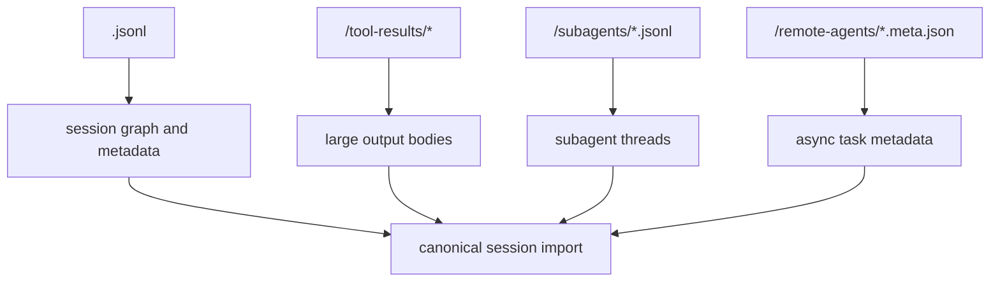

# Claude Code Filesystem And Storage

Claude Code stores conversations as files under the user's home directory.

The default root is:

```text
~/.claude/
```

This root can be overridden by `CLAUDE_CONFIG_DIR`, but the normal default is `~/.claude`.

## Top-Level Layout

```text
~/.claude/
├── projects/
│   └── <sanitized-absolute-cwd>/
│       ├── <session-id>.jsonl
│       ├── <session-id>.jsonl
│       └── <session-id>/
│           ├── tool-results/
│           ├── subagents/
│           └── remote-agents/
├── history.jsonl
└── sessions/
    └── <pid>.json
```

## What Each Part Means

### `projects/`

This is the real transcript store.

Each working directory gets its own folder under `projects/`, but the folder name is not the raw path. Claude Code sanitizes the absolute working directory into a filesystem-safe key.

Example:

```text
/Users/abdallah/Developer/playground/claude-code
-> ~/.claude/projects/-Users-abdallah-Developer-playground-claude-code/
```

The important detail for HowiCC is that the path is derived from the absolute cwd, not the git repository name.

### `<session-id>.jsonl`

This is the main session transcript.

It is append-only JSON Lines. Each line is a JSON object. The file contains:

- real transcript messages
- metadata events
- snapshots
- content replacement markers
- session state used for resume and display

It is not just a clean sequence of `user` and `assistant` text messages.

### `<session-id>/tool-results/`

Large tool outputs may be persisted here instead of being fully embedded in the transcript file.

This is essential for HowiCC because raw transcript parsing alone may only produce a preview marker instead of the full output body.

### `<session-id>/subagents/`

Subagent transcripts are stored separately here.

These are related to the parent session, but they should not be treated as top-level sessions during discovery.

### `<session-id>/remote-agents/`

Metadata for remote or async agent tasks can be stored here.

### `history.jsonl`

This is prompt history, not the canonical conversation transcript.

It supports shell-like history behavior and should not be used as the conversation source for HowiCC.

### `sessions/<pid>.json`

This is live process/session registry data used by Claude Code to track active processes and related session state.

It is not transcript data.

## Path Derivation Rules

Claude Code derives transcript storage paths in roughly this way:

```text
cwd
-> sanitizePath(cwd)
-> ~/.claude/projects/<sanitized-cwd>/
-> <session-id>.jsonl
```

Key functions involved:

- `getClaudeConfigHomeDir()`
- `sanitizePath()`
- `getTranscriptPath()`

## Transcript And Sidecar Relationship

The main transcript file and session folder must be considered together.



HowiCC should import the full session bundle, not just the `.jsonl` file.

## File Discovery Rules For HowiCC

Correct top-level session discovery should be:

```text
~/.claude/projects/<project-key>/<session-id>.jsonl
```

Incorrect discovery would be recursively treating every `.jsonl` under `projects/` as a top-level session. That would incorrectly include:

- subagent transcripts
- other nested auxiliary files

## Storage Implications For HowiCC

We should treat the imported source as a bundle with these parts:

- one top-level session transcript
- zero or more tool result sidecars
- zero or more subagent transcripts
- zero or more remote agent metadata files

That bundle should be preserved before any parsing or redaction happens.
