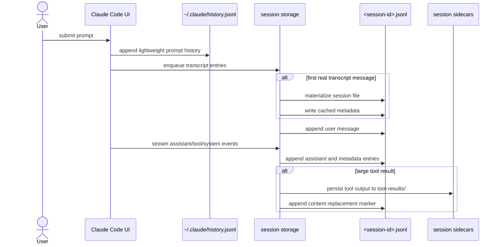

# Claude Code Transcript Lifecycle

This document explains how Claude Code writes session data to disk.

The important takeaway is that transcript files are created lazily, appended over time, and enriched with metadata that supports resume and UI behavior.

## High-Level Lifecycle



## Important Persistence Behaviors

### 1. Transcript File Creation Is Lazy

Claude Code does not necessarily create a session file immediately when a process starts.

It can keep metadata in memory and only materialize the `.jsonl` file when the first real `user` or `assistant` message is ready to be written.

This matters because HowiCC should not assume that all configuration-like state is present from the first line onward in a partially captured session.

### 2. The Transcript Is Append-Only

Entries are appended as JSONL.

This gives Claude Code these advantages:

- crash tolerance
- cheap writes
- resumability
- easy head/tail inspection for quick listing

It also means the file may contain historical or duplicated-looking metadata near the end.

### 3. Metadata May Be Re-Appended Near EOF

Claude Code re-appends important metadata at the end of the session to make resume-listing efficient.

That means title-like or branch-like metadata may exist in more than one place in the file.

HowiCC should resolve metadata by parser rules, not by grabbing the first occurrence only.

### 4. Large Tool Results Can Spill Into Sidecars

When tool output is too large, Claude Code can store the full body in `tool-results/` and write a replacement or reference event into the transcript.

If HowiCC imports only the JSONL, it may miss the actual output content the UI needs.

### 5. Session Files Use Restrictive Permissions

Claude Code writes these files with private permissions. That is a clue that transcript data may contain sensitive local material and should be treated carefully by HowiCC.

## What A Transcript Contains

A transcript file is not only message prose.

It can contain:

- `user` messages
- `assistant` messages
- `system` messages
- attachment-like entries
- mode and title metadata
- file history snapshots
- content replacement entries
- worktree state
- compact boundaries and other resume-related data

## Simplified Example

```json
{"type":"custom-title","sessionId":"abc","customTitle":"Fix login bug"}
{"type":"mode","sessionId":"abc","mode":"normal"}
{"type":"user","uuid":"u1","parentUuid":null,"message":{...}}
{"type":"assistant","uuid":"a1","parentUuid":"u1","message":{...}}
{"type":"file-history-snapshot","messageId":"a1","snapshot":{...}}
{"type":"content-replacement","sessionId":"abc","replacements":[...]}
```

The shape is event-rich. A trustworthy importer has to understand that richness instead of flattening immediately.

## Implications For HowiCC

We should keep three clear stages:

1. Preserve raw source bundle.
2. Parse into canonical structured data.
3. Derive UI-friendly render blocks.

We should not collapse stage 1 and stage 3 into one lossy markdown export step.
