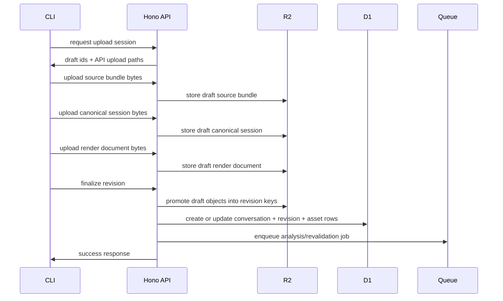

# Sync Protocol And Local State

The new sync protocol should treat every upload as a revisioned import, not just a one-off markdown paste.

## Revision Identity

Local sync state should be keyed by:

- provider
- session id
- source revision hash
- remote conversation id
- remote revision id

That prevents the current problem where one Claude Code session grows over time but local state still treats it as already synced forever.

## Recommended Local State Shape

```ts
type SyncedRevision = {
  provider: string
  sessionId: string
  sourceRevisionHash: string
  conversationId: string
  revisionId: string
  syncedAt: string
}
```

## Upload Protocol

Current implemented v1 flow:



## Direct-To-R2 Versus API Uploads

The original target was direct-to-R2 uploads from the CLI.

That is still a valid optimization path, but the first implemented version uses API-mediated byte uploads.

Reasons:

- simpler local development with Wrangler and Worker bindings
- easier request validation and ownership checks in one place
- smaller implementation surface for the first real end-to-end ingestion path

The draft-session model still preserves a clean migration path toward direct-to-R2 uploads later.

## Why Direct-To-R2 Uploads Are Still Interesting

They reduce:

- API memory pressure
- worker payload size concerns
- complexity around large transcript and artifact uploads

If upload volume or asset size becomes a real bottleneck, the contract can evolve so `assetTargets` return signed upload URLs instead of API upload paths.

## Draft Versus Final Revision

The backend should create a draft upload session first.

Only after all required artifacts are uploaded should the CLI finalize the revision.

That prevents half-finished records.

In the current implementation the draft session also tracks per-asset expected:

- kind
- sha256
- bytes
- content type

Finalize must reject any request whose asset metadata does not exactly match the uploaded draft assets.

## Sync Commands And Behaviors

### `howicc sync`

- finds candidate sessions
- parses revisions locally
- warns on privacy issues
- uploads only new or changed revisions by default

### `howicc sync --force`

- reuploads even if the same revision hash already exists locally

### `howicc sync --update-existing`

- attach a new revision to an existing conversation if the backend already knows the same source session lineage

## Failure Handling

The CLI should treat these as first-class failure cases:

- source bundle created but canonical parse failed
- upload session created but blob upload failed
- blob upload succeeded but finalize failed
- finalize succeeded but async analysis failed later

Each step should be recoverable or retryable without corrupting local sync state.
