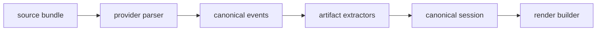

# Parser Packages And Provider Separation

HowiCC should separate provider-specific parsing from provider-neutral schemas and rendering.

This is important now, not later.

Claude Code is just the first serious adapter. If the parser stack is Claude-specific all the way down, we will repeat the same architecture mistake when we add Codex or other local agent platforms.

## Recommended Package Split

```text
packages/
├── contracts/
├── canonical/
├── render/
├── parser-core/
├── provider-claude-code/
├── provider-codex/
└── provider-shared-artifacts/
```

## What Each Package Owns

### `packages/canonical`

- canonical session schema
- canonical event schema
- shared type guards and validators

### `packages/render`

- render document schema
- deterministic grouping helpers
- frontend-facing block builders

### `packages/parser-core`

- generic bundle primitives
- revision hashing
- privacy scanning interfaces
- artifact extraction interfaces
- parser orchestration helpers

### `packages/provider-claude-code`

- Claude Code discovery
- Claude Code source bundle builder
- Claude Code transcript parser
- Claude Code-specific artifact extractors

Suggested extractors:

- `extractPlanArtifacts`
- `extractQuestionArtifacts`
- `extractToolRejectionArtifacts`
- `extractSubagentArtifacts`
- `extractPersistedToolOutputs`

### `packages/provider-codex`

- future OpenAI Codex-specific discovery and parsing

### `packages/provider-shared-artifacts`

- shared logic for interaction artifacts that multiple providers may emit
- generic helpers for:
  - questions
  - approvals
  - plan context
  - tool rejection classification

## Why Artifact Extractors Deserve Their Own Boundary

Not every parser concern is just raw event parsing.

Some features are better expressed as structured extracted artifacts layered on top of parsed events:

- plans
- user question interactions
- tool rejections and redirects
- review or approval decisions

Keeping those as separate extractors gives us:

- easier iteration
- smaller test surface per feature
- better provider reuse
- less risk of turning the main parser into one giant file

## Recommended Flow



That keeps the event parser focused on fidelity and the artifact layer focused on usability.

## Claude Code-Specific Early Artifact Set

For the first provider, we should explicitly support these artifact families:

1. plans
2. AskUserQuestion interactions
3. tool rejections and redirects
4. persisted tool outputs
5. subagent threads

## Testing Strategy

Each provider package should have fixture-based tests using real anonymized session bundles.

Each artifact extractor should have its own tests against canonical event fixtures.

That will make it much easier to evolve the Claude Code adapter without destabilizing future providers.
