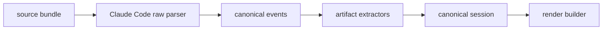

# Claude Code Artifact Extractors

This document defines how the Claude Code adapter should extract higher-level structured artifacts from parsed events.

The raw transcript parser should focus on fidelity.

Artifact extractors should focus on turning parsed events into stable, user-meaningful structures.

## Why Extractors Need Their Own Layer

If we put all artifact logic in the raw parser, the parser becomes:

- harder to test
- more Claude-specific than necessary
- harder to evolve when the UI changes

A better design is:



## Recommended Package Layout

Inside `packages/provider-claude-code/`:

```text
src/
├── discover/
├── bundle/
├── parse/
├── extractors/
│   ├── plans.ts
│   ├── questions.ts
│   ├── tool-decisions.ts
│   ├── tool-outputs.ts
│   ├── todos.ts
│   ├── task-status.ts
│   ├── mcp-resources.ts
│   ├── structured-output.ts
│   ├── invoked-skills.ts
│   └── brief.ts
└── buildCanonicalSession.ts
```

## Extractor Interface

Recommended interface:

```ts
type ArtifactExtractor<TArtifact> = {
  name: string
  extract(input: {
    bundle: SourceBundle
    events: CanonicalEvent[]
    agents: AgentThread[]
  }): Promise<TArtifact[]>
}
```

## Recommended Artifact Families

## 1. Plan Extractor

Input sources:

- plan file
- `file_snapshot`
- `plan_file_reference`
- `ExitPlanMode` tool-use input
- approved plan tool-result text
- `user.planContent`

Output artifact:

- `plan`

## 2. Question Extractor

Input sources:

- `AskUserQuestion` assistant tool-use input
- paired user `toolUseResult`
- paired user `tool_result` text

Output artifact:

- `question_interaction`

## 3. Tool Decision Extractor

Input sources:

- paired `tool_use` and `tool_result.is_error`
- reject feedback text
- hook-stopped-continuation attachments
- permission-related rejection content

Output artifact:

- `tool_decision`

This extractor should classify:

- rejection
- redirect
- abort
- hook block
- interrupted tool execution

## 4. Tool Output Extractor

Input sources:

- `toolUseResult`
- persisted `tool-results/`
- truncation or replacement metadata

Output artifact:

- `tool_output_artifact`

This extractor should prefer preserving previews plus lazy-load references for very large bodies.

## 5. Todo Extractor

Input sources:

- `TodoWrite` assistant tool-use input
- `TodoWrite` user `toolUseResult`
- `todo_reminder` attachments

Output artifact:

- `todo_snapshot`

## 6. Task Status Extractor

Input sources:

- `task_status` attachments
- agent and background task metadata

Output artifact:

- `task_status_timeline`

## 7. MCP Resource Extractor

Input sources:

- `mcp_resource` attachments
- `ReadMcpResourceTool` structured output

Output artifact:

- `mcp_resource`

## 8. Structured Output Extractor

Input sources:

- `structured_output` attachments
- tools that return machine-readable data

Output artifact:

- `structured_output`

## 9. Invoked Skill Extractor

Input sources:

- `invoked_skills` attachments

Output artifact:

- `invoked_skill_set`

## 10. Brief Extractor

Input sources:

- `BriefTool` / `SendUserMessage` tool results
- attachment metadata including `file_uuid`

Output artifact:

- `brief_delivery`

## Artifact Priority Matrix

### V1 Required

- plans
- question interactions
- tool decisions
- persisted tool outputs

### V1.5 Strongly Recommended

- todo snapshots
- task status timelines

### V2

- MCP resources
- structured outputs
- invoked skills
- brief deliveries

## Suggested Canonical Artifact Union

The Claude Code adapter should eventually produce a typed artifact union like this:

```ts
type SessionArtifact =
  | PlanArtifact
  | QuestionArtifact
  | ToolDecisionArtifact
  | ToolOutputArtifact
  | TodoSnapshotArtifact
  | TaskStatusTimelineArtifact
  | McpResourceArtifact
  | StructuredOutputArtifact
  | InvokedSkillSetArtifact
  | BriefDeliveryArtifact
```

That union can live in `packages/canonical` once it stabilizes.

## Extractor Ordering

Suggested order:

1. parse raw events
2. repair graph relationships
3. pair tool-use and tool-result events
4. extract plans
5. extract question interactions
6. extract tool decisions
7. extract outputs, todos, task state, and other artifacts
8. attach artifact references to the canonical session

This ordering helps later extractors reuse earlier structured links.

## Test Strategy

Each extractor should have:

- fixture-driven tests with anonymized Claude Code bundles
- tests for happy path
- tests for compaction/recovery path
- tests for missing-file fallback path
- tests for partial or rejected interactions

That is the best way to keep the Claude Code adapter reliable as we iterate.
