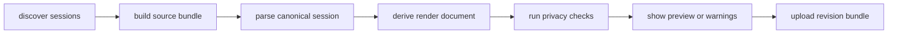

# CLI Rebuild

The CLI should become the authoritative importer for local agent conversations.

Its job is not to guess a nice markdown transcript. Its job is to:

1. discover source sessions correctly
2. preserve the raw source bundle
3. parse into a canonical session shape
4. derive a render document
5. perform privacy checks and optional redaction
6. sync a revision to the platform

## Why The CLI Owns This

The user's machine has the only complete view of the local source files.

That includes:

- raw transcript JSONL
- sidecar tool results
- subagent threads
- private local paths that may need redaction

Putting this responsibility in the CLI gives us:

- deterministic imports
- better local preview
- earlier privacy checks
- simpler backend contracts

## The New CLI Pipeline

## Target Outputs

Every imported revision should produce three durable artifacts:

- `source bundle`
- `canonical session`
- `render document`

The CLI should be able to inspect and export all three locally.

## Document Map

- `01-cli-responsibilities.md`
- `02-discovery-and-bundling.md`
- `03-canonical-session-schema.md`
- `04-render-document-schema.md`
- `05-sync-protocol-and-local-state.md`
- `06-privacy-redaction-and-provider-adapters.md`
- `07-parser-packages-and-provider-separation.md`
- `08-claude-code-artifact-extractors.md`
- `09-session-artifact-union.md`
- `10-canonical-to-render-mapping.md`
- `11-architectural-principles-and-invariants.md`
- `12-schema-versioning-and-compatibility.md`
