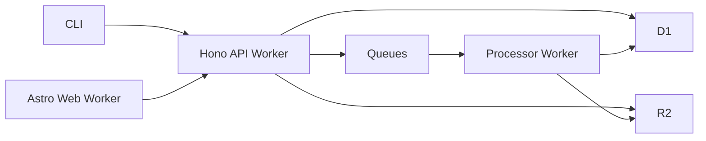

# Cloudflare Architecture

This is the recommended target architecture for the HowiCC revamp.

## Recommendation

Use:

- Astro on Cloudflare Workers for the website
- Hono on Cloudflare Workers for the API
- D1 for relational metadata
- R2 for transcript and artifact blobs
- Queues for ingest, analysis, and reprocessing

## Why This Fits The Product

HowiCC needs:

- globally available public pages
- low-friction API endpoints for CLI sync
- cheap storage for structured metadata
- blob storage for large transcript-derived artifacts
- asynchronous processing for analysis and re-rendering

Cloudflare maps well to those needs.

## High-Level Architecture

## Role Of Each Part

### Astro Web

- landing pages
- authenticated app shell
- public conversation pages
- settings and token management UI

### Hono API

- upload session creation
- revision finalization
- publish and visibility APIs
- artifact fetch APIs
- auth-related application endpoints
- health checks and admin endpoints

### D1

Store metadata only:

- users
- sessions
- API tokens
- conversations
- revisions
- tags
- publish state

### R2

Store large or versioned files:

- source bundle archives
- canonical session JSON
- render document JSON
- large artifact bodies

### Queues

Handle work that should not block user requests:

- AI analysis
- privacy revalidation
- re-rendering after parser upgrades
- artifact indexing

## Why D1 Plus R2 Is Better Than One Store

The system has two very different data classes.

### Metadata

Good fit for D1:

- structured records
- relationships
- filtering and listing
- ownership and visibility state

### Blob Artifacts

Good fit for R2:

- large transcript-derived files
- versioned canonical documents
- persisted tool outputs
- future downloadable exports

## Workers-First Backend Rule

Backend logic should be designed to run inside Cloudflare Workers from the start.

That means:

- avoid Node-only server assumptions in shared backend code
- isolate filesystem-specific logic to the CLI
- use explicit storage bindings
- keep large uploads out of hot request paths when possible

## Recommended Direction

Use separate deployable apps under one workspace:

- `apps/web`
- `apps/api`
- `apps/worker-jobs`

That keeps the website, API, and background processing cleanly separated while still sharing contracts and types.
