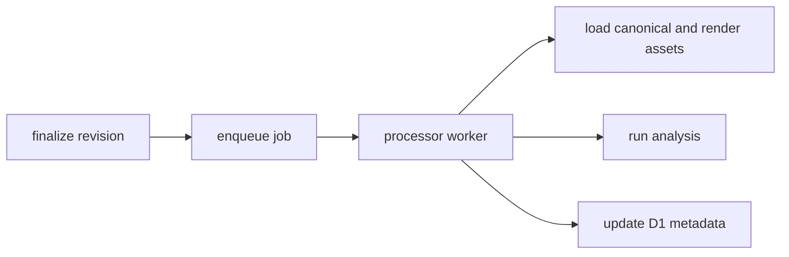

# Processing, Observability, And Operations

This document covers background jobs, platform observability, and operational hygiene.

## Queue-Based Processing

Do not block user-facing API requests on heavy post-upload work.

Use Cloudflare Queues for:

- AI analysis
- privacy revalidation
- parser upgrade reprocessing
- render regeneration
- artifact indexing

## Suggested Processing Flow



## Why This Matters

The CLI sync contract should remain fast and deterministic.

Post-upload enrichment can happen asynchronously as long as the user immediately gets a valid draft or revision response.

## Observability Goals

We should be able to answer:

- which revisions failed import or processing
- why a render document is stale
- which API route is failing in production
- whether queue backlogs are growing
- which artifact fetches are hot

## Suggested Operational Signals

- API request count and latency by route
- queue depth and failure count
- revision finalize success rate
- privacy warning rate
- render generation duration
- artifact fetch count

## Cloudflare-Native Monitoring Direction

Use Cloudflare dashboards first for:

- Worker traffic and error rates
- queue metrics
- D1 health
- R2 usage

Then add structured application logs and, if needed, an external error tracker later.

## Resource Naming Convention

Use clear environment-prefixed resource names so the Cloudflare dashboard stays understandable.

Example:

```text
howicc-prod-api
howicc-prod-web
howicc-prod-jobs
howicc-prod-db
howicc-prod-assets
howicc-prod-queue
```

That makes it easier to trace issues and avoid environment confusion.
