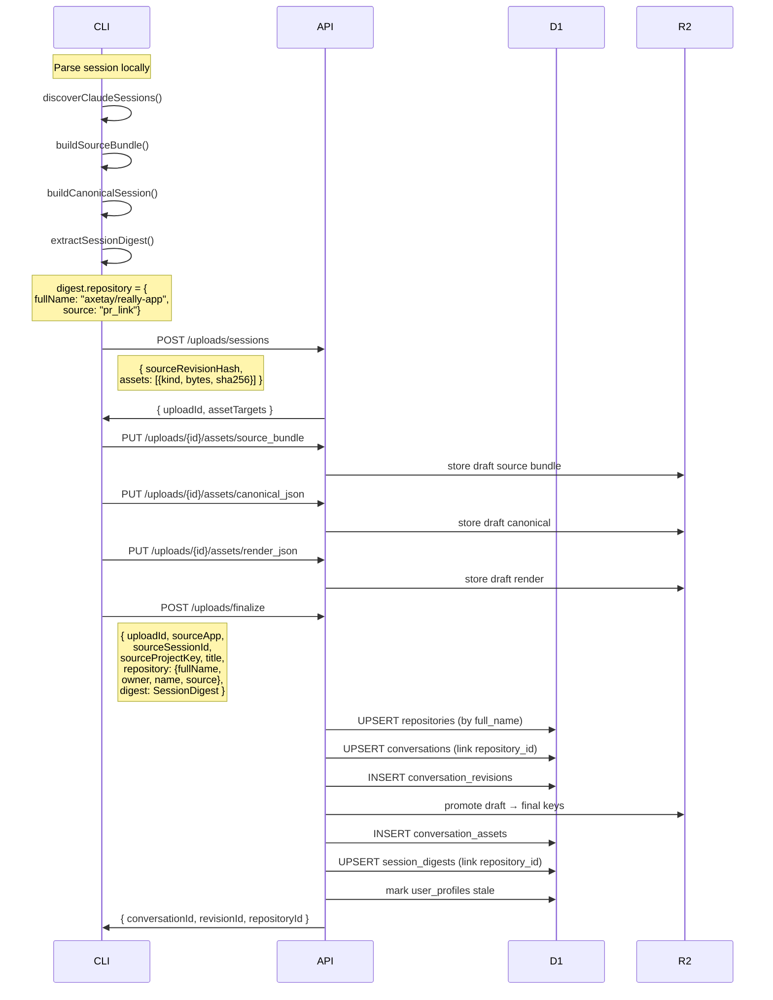

# Repositories And Project Grouping

> **Related:** Visual treatment of repo pages is specified in
> [The Archive design system](20-design-md-the-archive.md). Team features
> and GitHub access are in [doc 16](16-team-access-and-github-integration.md).
> Repo page wireframes are in [doc 17 Page 8](17-web-app-pages-and-screens.md).

## Problem

Conversations exist in a flat list per user. When a developer works on `axetay/really-app` from 4 different working directories (main checkout, two worktrees, a parent dir), these appear as separate projects. There is no way to:

- See all sessions for a repo in one place
- Share a repo-level profile ("here's how our team uses AI on this project")
- Group sessions by what they ship to, not where they ran from

## JTBD

### As a solo developer

**When** I sync my Claude Code sessions
**I want** them automatically grouped by the repository I was working in
**So that** I can see my AI usage per project, not per directory

### As a team member

**When** my teammate shares their howi.cc profile
**I want** to see their work on our shared repos
**So that** I can learn from their AI workflows on the same codebase

### As a team lead

**When** I look at our shared repository on howi.cc
**I want** to see aggregated AI usage across all team members
**So that** I can understand how the team uses AI tools on this project

## Data Model

### Repository as a shared entity

```
repositories (global, unique by full_name)
  ├── user A's conversations  (axetay/really-app from ~/work/really-app)
  ├── user A's conversations  (axetay/really-app from ~/.superset/worktrees/...)
  ├── user B's conversations  (axetay/really-app from ~/dev/really-app)
  └── user C's conversations  (axetay/really-app from /home/carl/projects/really)
```

A repository is NOT owned by any single user. It exists as a shared grouping entity. Any user who syncs sessions from the same repo links to the same row.

### Tables

```sql
CREATE TABLE repositories (
  id            TEXT PRIMARY KEY,
  full_name     TEXT NOT NULL UNIQUE,   -- "axetay/really-app"
  owner         TEXT NOT NULL,          -- "axetay" (org/owner in VCS)
  name          TEXT NOT NULL,          -- "really-app"
  provider      TEXT NOT NULL,          -- "github" | "gitlab" | "bitbucket"
  provider_url  TEXT,                   -- "https://github.com/axetay/really-app"
  created_at    INTEGER NOT NULL,
  updated_at    INTEGER NOT NULL
);

-- conversations gains a nullable FK
ALTER TABLE conversations ADD COLUMN repository_id TEXT;

-- session_digests gains a nullable FK for efficient repo queries
ALTER TABLE session_digests ADD COLUMN repository_id TEXT;
CREATE INDEX session_digests_repo_idx ON session_digests(repository_id);
```

### Relationships

```
users ──1:N──> conversations ──N:1──> repositories (optional)
users ──1:N──> session_digests ──N:1──> repositories (optional)
repositories ──1:N──> conversations (from any user)
```

A conversation always has `owner_user_id`. It optionally has `repository_id`. A conversation without a repository is ungrouped (ran from a non-git directory).

## Repository Resolution

Three-tier detection, highest confidence wins:

```
TIER    SOURCE              HOW                                EXAMPLE
────    ──────              ───                                ───────
  1     pr-link entry       Parse GitHub PR URL from JSONL     axetay/really-app (from PR #138)
  2     git remote          Regex on Bash tool result text     axetay/really-app (from git remote output)
  3     cwd path            Derive from working directory      personal/howicc (fallback)
```

This already exists in `digestHints.repository` (implemented in v5). The sync flow just needs to send it to the API.

## Visibility State Machine

```
                    ┌─────────────────┐
                    │    PRIVATE       │  Default. Only the owner sees it.
                    │                  │  Conversations visible to owner only.
                    └────────┬────────┘
                             │ owner opts in
                             ▼
                    ┌─────────────────┐
                    │    MEMBERS      │  People who have synced sessions to
                    │                  │  the same repo can see aggregate stats.
                    │                  │  Individual conversations still private.
                    └────────┬────────┘
                             │ owner publishes
                             ▼
                    ┌─────────────────┐
                    │    PUBLIC        │  Anyone can see the repo profile
                    │                  │  and published conversations.
                    └─────────────────┘
```

### What each visibility level exposes

```
PRIVATE (default)
  Owner sees:
    ✓ All their conversations in this repo
    ✓ Their personal repo stats
  Others see:
    ✗ Nothing

MEMBERS
  Owner sees:
    ✓ All their conversations
    ✓ Aggregate repo stats (all members combined)
  Other repo members see:
    ✓ Aggregate repo stats
    ✓ Their own conversations
    ✗ Other people's individual conversations
  Public sees:
    ✗ Nothing

PUBLIC
  Everyone sees:
    ✓ Aggregate repo stats
    ✓ Member list (who contributes)
    ✓ Conversations marked as published
  Members additionally see:
    ✓ Their own private conversations
```

### Conversation visibility vs repository visibility

These are independent:

```
Repository: MEMBERS          Conversation: PRIVATE
→ Repo stats visible to members, this specific conversation hidden

Repository: MEMBERS          Conversation: PUBLIC
→ This conversation visible to everyone (even non-members)

Repository: PRIVATE          Conversation: PUBLIC
→ Conversation visible via direct link, but repo profile hidden
```

## Sync Sequence (CLI → API)



## API Read Paths

### User's conversations (existing, enhanced)

```
GET /conversations
GET /conversations?repositoryId=repo_abc
GET /conversations/{id}/render
GET /conversations/{id}/artifacts/{artifactId}
```

### User's repositories (new)

```
GET /repos
→ [{ id, fullName, provider, sessionCount, lastActiveAt }]

GET /repos/{owner}/{name}
→ { repository, stats, conversations[], digest aggregation }
```

### Public repo profile (new)

```
GET /r/{owner}/{name}
→ { repository, aggregateStats, memberCount, publicConversations[] }
```

This is the page at `howi.cc/r/axetay/really-app`.

## What Gets Stored Where

```
D1 (metadata)                          R2 (blobs)
─────────────                          ──────────
repositories                           (nothing new)
  id, full_name, owner, name,
  provider, provider_url

conversations
  + repository_id (nullable FK)

session_digests
  + repository_id (nullable FK)
  digest_json contains repository field
```

No new R2 objects. The repository is pure metadata derived from what's already in the session digest.

## Migration Path

### Step 1: Add tables and columns

```sql
CREATE TABLE repositories (...);
ALTER TABLE conversations ADD COLUMN repository_id TEXT;
ALTER TABLE session_digests ADD COLUMN repository_id TEXT;
CREATE INDEX ...;
```

### Step 2: Backfill from existing digests

```sql
-- For each unique repository in session_digests.digest_json,
-- create a repository row and update the FK
```

This can be a one-time migration script or a lazy backfill on first read.

### Step 3: Update finalize to upsert repository

The upload finalize handler receives `repository` from the CLI and:
1. Upserts into `repositories` by `full_name`
2. Sets `conversations.repository_id`
3. Sets `session_digests.repository_id`

### Step 4: Add API read routes

New routes for repo listing, repo profile, and public repo page.

## Open Questions

1. **Should repository visibility be a column on `repositories` or a separate membership table?**
   Start with a column. Add a membership table later if we need per-user visibility overrides.

2. **How do we handle repository renames (org changes, repo transfers)?**
   Match by `full_name`. If a repo is renamed, it becomes a new repository row. Old conversations stay linked to the old name until re-synced.

3. **Should the CLI also send `git remote get-url origin` directly?**
   Not yet. The current three-tier resolution (pr-link > tool result text > cwd) is reliable for 91% of sessions. Adding a subprocess call at sync time would be more reliable but introduces a shell dependency. Consider for v2.

4. **How do we handle monorepo subdirectories?**
   Multiple cwds within the same git repo map to the same `full_name`. The repository resolution already handles this — `~/work/axetay/really-app` and `~/.superset/worktrees/really-app/feat/wave0` both resolve to `axetay/really-app`.
